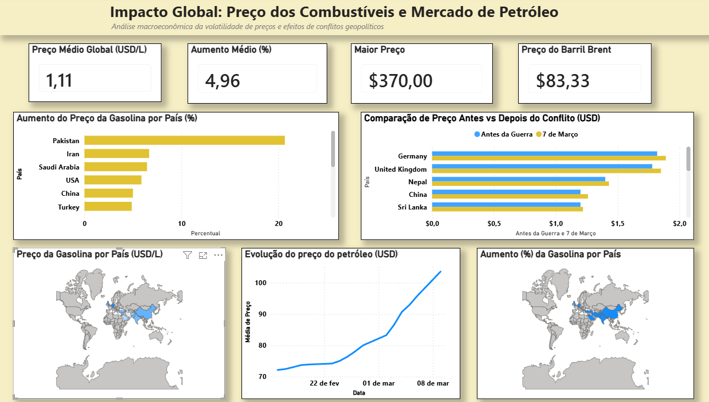

## 📊 Grupo44 - Projeto de Análise de Dados

Projeto desenvolvido por alunos do curso de **Análise e Desenvolvimento de Sistemas (SENAC EAD)**, como parte da disciplina:

**2601 – Projeto Integrador: Desenvolvimento Low Code em Ciência de Dados**

## 🔗 Repositório

Acesse o projeto no GitHub:  👉 [https://github.com/CesarSilveira-96/Grupo44-PI-ADS-Senac/tree/main](https://github.com/RicardoLeaoDEV/Grupo44-PI-ADS-Senac/blob/main/README.md)

## 📌 Descrição do Projeto

Este projeto tem como objetivo realizar a análise de uma base de dados utilizando um processo de **ETL (Extração, Transformação e Carga)**, além da criação de um **dashboard interativo**.

A análise foca nos **preços globais da gasolina** e no impacto do conflito entre **Estados Unidos e Irã em 2026**.

## 📊 Base de Dados

- **Nome:** Global Petrol Prices — Impact of 2026 US-Iran War  
- **Fonte:** Kaggle  
- **Autor:** zkskhurram
- **Formato:** CSV  
- **Tamanho:** ~150–300 KB
- **Linhas:** ~250 a 600

## 🔗 **Dataset:**  
https://www.kaggle.com/datasets/zkskhurram/global-petrol-prices-impact-of-2026-us-iran-war

## ⚠️ Origem e Confiabilidade dos Dados

O dataset foi disponibilizado na plataforma Kaggle pelo usuário **zkskhurram**, sendo voltado para fins educacionais e analíticos.

Os dados possuem caráter **simulado/hipotético**, representando um cenário de impacto de um conflito geopolítico (EUA x Irã em 2026) sobre os preços globais da gasolina.

Por se tratar de um conjunto de dados sintético, não há garantia de atualização contínua ou correspondência com dados reais em tempo real. Ainda assim, o dataset é adequado para práticas de análise de dados, modelagem de processos ETL e construção de dashboards.

Sua utilização neste projeto tem como objetivo explorar padrões, tendências e possíveis impactos em um cenário controlado, permitindo o desenvolvimento de habilidades analíticas.

## 🎯 Tema

Preços globais da gasolina e o impacto do conflito entre Estados Unidos e Irã em 2026.

## 🌍 Contexto

O dataset reúne informações sobre preços de combustíveis em diversos países.

A proposta é analisar como **eventos geopolíticos** impactam:
- o mercado global de energia
- os preços da gasolina
- a economia internacional

## 🎯 Objetivo da Análise

Analisar como conflitos geopolíticos influenciam o mercado global de energia, identificando:
- padrões de variação de preços
- impactos regionais
- mudanças ao longo do tempo

## 🛠️ Tecnologias e Ferramentas

- **Linguagem:** Python  
- **Bibliotecas:** Pandas, NumPy, Matplotlib, Seaborn  
- **Dashboard:** Power BI
- **Versionamento:** Git e GitHub  

## **📁 Estrutura do Repositório**

```text
├── data/
│   ├── raw/                  # Dados brutos coletados originalmente
│   └── processed/            # Dados limpos e tratados (dados_tratados_final.xlsx, dados_oil_final.xlsx)
├── notebooks/                # Scripts Python de Análise de Dados e ETL (analise_dados_preco.ipynb)
├── dashboard/                # Arquivo oficial do Power BI (PI_Impacto_Preco_Combustiveis_2026.pbix)
├── images/                   # Elementos visuais e capturas de tela (dashboard10.png)
├── README.md                 # Documentação principal do projeto
└── app.py                    # Script principal da aplicação Web no Streamlit Cloud
```

## 📊 Análise e Visualização de Dados

O relatório foi estruturado no Power BI para fornecer respostas rápidas e interativas aos decisores:

### 📈 Visualizações Desenvolvidas

- **KPI – Preço Médio Global (USD)**
  - Apresenta a média global do preço da gasolina após o conflito.

- **Mapa Geográfico**
  - Exibe a distribuição dos preços da gasolina por país, permitindo análise visual global.

- **Gráfico de Comparação (Antes vs Depois)**
  - Compara os preços da gasolina antes e após o conflito, evidenciando o impacto direto.

- **Ranking de Aumento (%)**
  - Mostra os países com maior variação percentual nos preços.

- **Gráfico de Linha (Petróleo)**
  - Apresenta a evolução do preço médio do petróleo ao longo do tempo.

### 🎯 Principais Insights

- Observou-se aumento significativo nos preços da gasolina em diversos países.
- Países com maior dependência de importação de petróleo apresentaram maior impacto.
- O aumento do preço do petróleo está diretamente relacionado ao aumento da gasolina.
- Eventos geopolíticos influenciam diretamente o mercado global de energia.

### 🛠️ Ferramentas Utilizadas

- Python (Pandas, NumPy)
- Jupyter Notebook
- Power BI
- Git e GitHub
- streamlit

---

## 📊 Dashboard

O dashboard foi desenvolvido no Power BI e apresenta uma visão integrada dos dados analisados.

## 🖼️ Preview do Dashboard



## 🔗 Dashboard Publicado

### Microsoft Power BI Service
👉 [Acesse o Dashboard Interativo](https://app.powerbi.com/groups/me/reports/4da2c4cd-d9e5-4ad0-9100-386690edfee4/a60efa718b879d021269?experience=power-bi)

### Aplicação Web em Streamlit
👉 [Acesse o Dashboard no Streamlit](https://grupo44-pi-ads-senac-es6gvjnuzxfbdjsedl2ygi.streamlit.app)

## 📌 Principais análises:
- Comparação temporal
- Análise geográfica
- Variação percentual por país
  
## 🔄 Processo ETL

O processo de ETL (Extração, Transformação e Carga) foi estruturado para garantir a qualidade, consistência e confiabilidade dos dados utilizados na análise.

### 1. Extração
A extração dos dados é realizada a partir de um arquivo CSV obtido no Kaggle, utilizando a biblioteca **Pandas** no Python: ```df = pd.read_csv('data/raw/dataset.csv')```

### 2. Transformação

Nesta etapa, os dados passam por um processo de limpeza e padronização, incluindo:
- Tratamento de valores ausentes (remoção ou imputação)
- Remoção de registros duplicados
- Padronização de nomes de países
- Conversão de tipos de dados (ex: datas e valores numéricos)
- Normalização dos preços para uma unidade padrão (USD por litro)
- Identificação e tratamento de outliers
- Criação de novas variáveis (feature engineering), como:
  - Variação percentual de preços
  - Classificação por regiões geográficas
  - Indicadores de impacto do conflito

### 3. Carga

Após o tratamento, os dados são armazenados para uso nas análises e visualizações:

- Exportação para arquivos CSV e/ou Parquet: ```df.to_csv('data/processed/dados_tratados.csv', index=False)```
---
**Os dados tratados no processo de ETL serão utilizados diretamente na construção do dashboard, garantindo consistência nas métricas e visualizações.**

## 📊 Dashboard (Planejado)

O dashboard será desenvolvido com o objetivo de permitir a análise interativa dos preços globais da gasolina, com foco em variações temporais e impactos geopolíticos.

### 📈 Visualizações e Justificativas

- **Série temporal de preços**
  - Permite analisar a evolução dos preços ao longo do tempo e identificar tendências e impactos do conflito.

- **Mapa mundial (Choropleth)**
  - Facilita a comparação geográfica entre países, destacando regiões mais afetadas.

- **Comparação antes/depois do conflito**
  - Ajuda a identificar mudanças significativas nos preços causadas pelo evento analisado.

- **Distribuição de preços (Boxplot/Violino)**
  - Permite visualizar a dispersão dos dados e identificar outliers.

- **Gráfico de dispersão (Correlação)**
  - Avalia relações entre variáveis, como região e variação de preços.

### 📌 Principais Métricas

- Preço médio global  
- Variação percentual dos preços  
- Países com maior aumento/redução  
- Ranking de preços por país  

### 🎯 Objetivo do Dashboard

Fornecer uma visão clara e interativa dos impactos do cenário geopolítico nos preços da gasolina, permitindo análises comparativas e identificação de padrões globais.

## 🔄 Status do ETL

| Etapa         | Status         |
|--------------|----------------|
| Extração     | ✅ Concluído    |
| Transformação| ✅ Concluído    |
| Carga        | ✅ Concluído    |

## 📊 Status do Projeto

| Etapa                       | Status         |
|---------------------------|----------------|
| Repositório               | ✅ Concluído     |
| Base de dados             | ✅ Concluído     |
| Limpeza                   | ✅ Concluído     |
| Análises                  | ✅ Concluído     |
| Visualizações             | ✅ Concluído     |
| Resultados                | ✅ Concluído     |
| Documentação final        | ✅ Concluído     |

## 🗓️ Planejamento

| Semana   | Atividade                                                |
|----------|----------------------------------------------------------|
| Semana 1 | Criação do repositório e documentação inicial            |
| Semana 2 | Seleção da base de dados e definição do escopo           |
| Semana 3 | Limpeza e tratamento dos dados                           |
| Semana 4 | Análises e hipóteses                                     |
| Semana 5 | Construção do dashboard                                  |
| Semana 6 | Interpretação dos resultados                             |
| Semana 7 | Documentação final e entrega                             |

## 👥 Responsabilidades

| Tarefa                         | Responsável        |
|--------------------------------|--------------------|
| README                         | Todos              |
| Análise inicial                | Allan + César      |
| Tratamento de dados            | Marcos + Ricardo   |
| Análises                       | Paulo              |
| Dashboard                      | Todos              |
| Conclusões                     | César  + Ricardo   |
| Documentação                   | Allan              |
| Revisão final                  | Marcos + Paulo     |

## 👨‍💻 Integrantes

| Nome           | GitHub                                      | Email                         |
|----------------|---------------------------------------------|-------------------------------|
| César Silveira | https://github.com/CesarSilveira-96         | cesarsilveira35@gmail.com     |
| Allan Lima | https://github.com/slimaallan-ops           | slima.allan@gmail.com         |
| Marcos         | https://github.com/marcospaulofbahia                | marcosbahia2605@gmail.com     |
| Paulo Mesquita | https://github.com/usuario                  | paulo_henrique.dm@hotmail.com |
| Ricardo Leão   | https://github.com/RicardoLeaoDEV           | ricardoleao_1997@live.com     |
---
